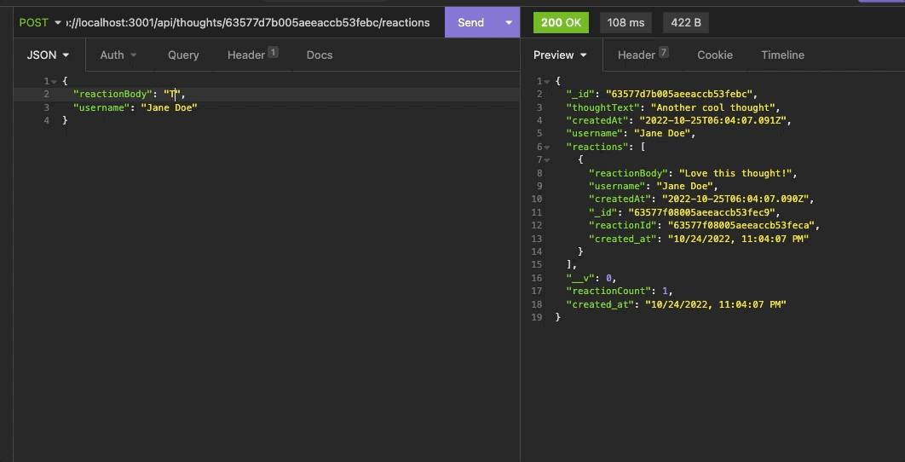
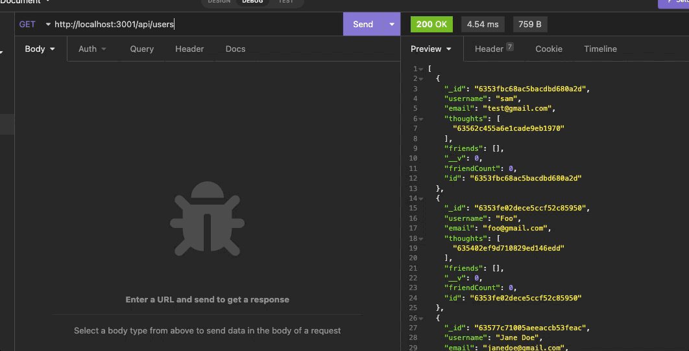
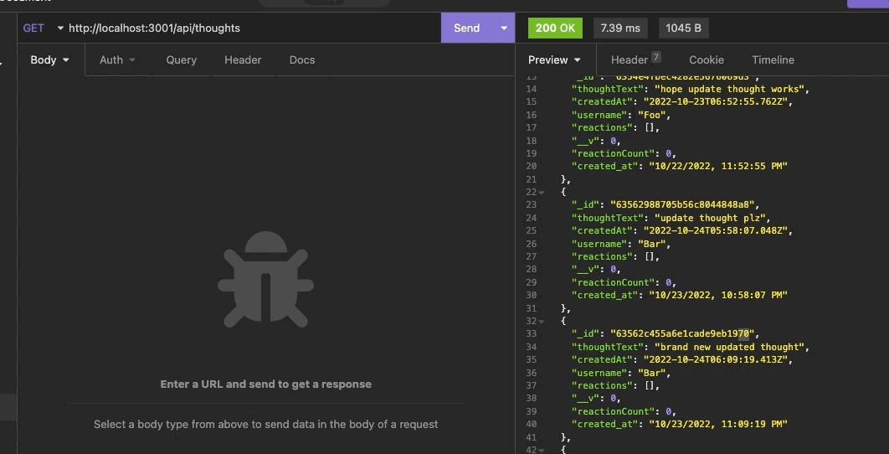
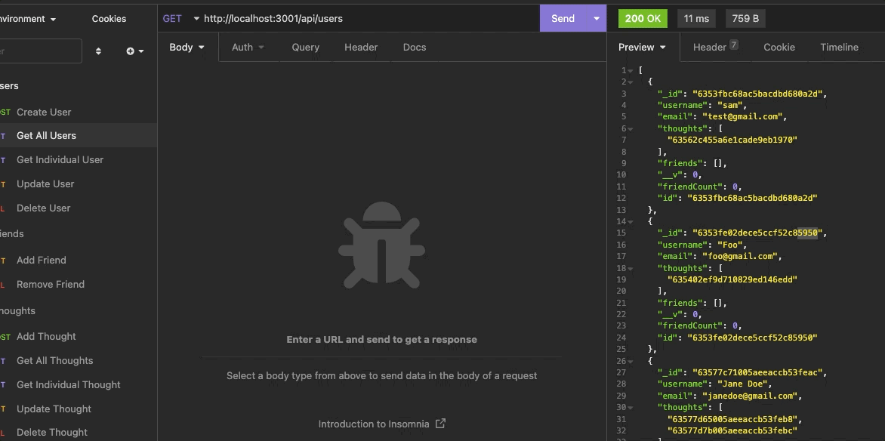
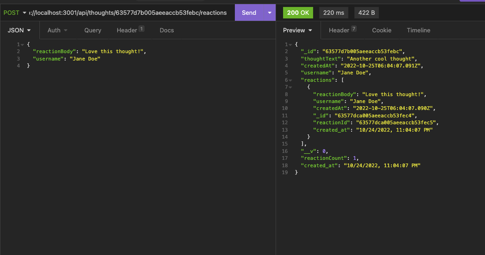
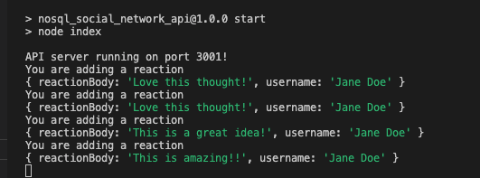
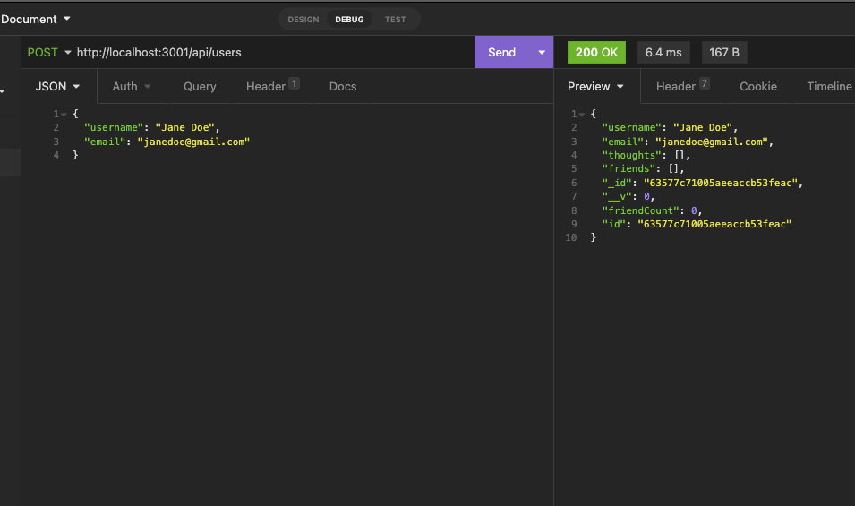

# NoSQL Social Network API

## 18 NoSQL Challenge

Built the backend API structure for a social media app. The API is built with JavaScript and runs through Node.js. The app is capable of running CRUD routes for any users, it is also able to connect 'thoughts' (status updates) connected to a user and run CRUD routes for thoughts. Individual users are able to be connected to other users as 'friends' and user friends are stored in a friend array. Routes for adding and deleting friends are connected and working. Reactions are able to be posted and deleted from user thoughts as well. 

---

## Areas Covered:
* The app structure is built with JavaScript, and runs through Node.js
* Express.js is used for the routing.
* MongoDB is the database used, and utilizes the mongoose package.
* All CRUD routes were tested using Insomnia.
* Screen recorded demonstration of app functions.

---

## Installation Instructions:
* Open `integrated terminal` in VS Code
* Run `npm install` to install all dependencies
* Run `npm start` to start application.
* Open an `Insomnia` window, and navigate to `http://localhost:3001/api` to test CRUD routes.

---

## Tech Stack:
* JavaScript
* Node.js
* Mongoose
* MongoDB
* Express
* Insomnia

---

## About The Author:

My name is Kent Shaffer and I am a student coming to the end of UCSD's full stack web development bootcamp. Prior to starting the program I had zero code experience, so it feels I've been drinking in new information through a fire hose, but I have been loving learning, and I'm excited about all the possibilities that live within the scope of the technologies I have been learning.

If you have any questions or would like to get in contact, I can be reached at kentshaff@gmail.com 

---

## Video of application functionality: 

(https://watch.screencastify.com/v/Q7s7704JF2KXaKCuMijH›)

---
## Screenshots and Gifs of app:

---
